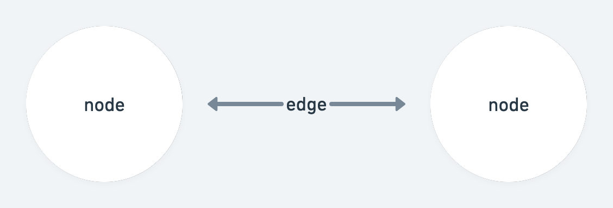
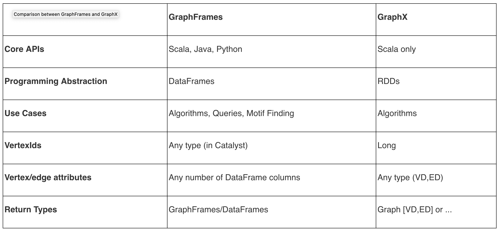
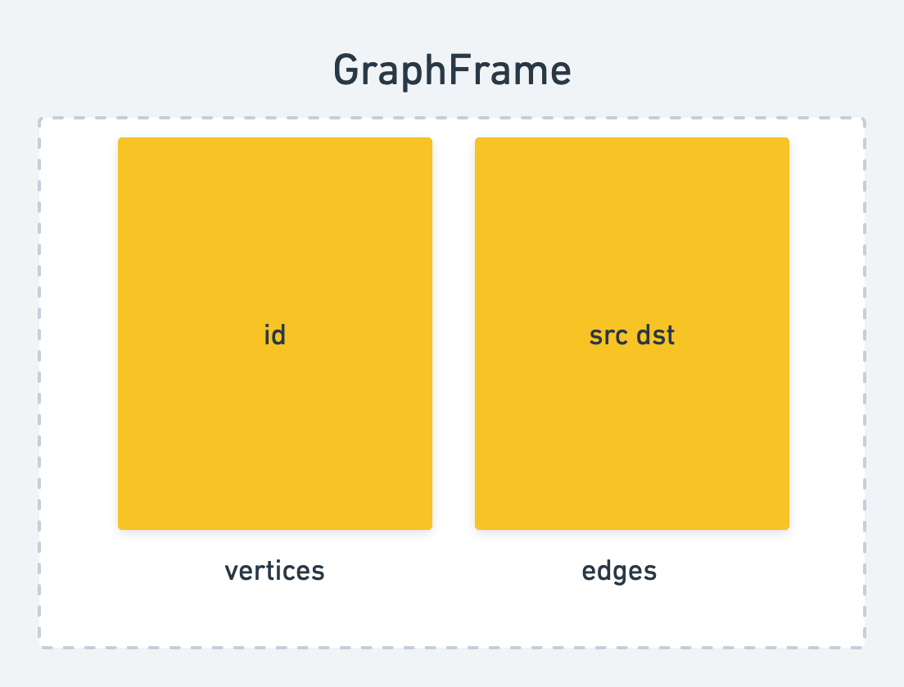

---
title: Graphs
date: 2022-11-22
----

Graphs are trees where there is no restriction that each node only has to have one parent node. Graphs have vertices, which are the 
items we want to traverse, and edges that connect the vertices. 

Graphs can be undirected or directed. Directed graphs, or digraphs, are graphs whose edges are directed from one vertex to another. 

```
         +---+         
         |V7 |         
         +---+         
           |           
           v           
       +-------+       
       |  V1   |       
       +-------+       
         |  ||         
     -----  |--------  
     |      ---     |  
     v        |     |  
  +-----+     |     |  
  | V2  |     |     |  
  +-----+     |     |  
    | |       |     |  
  --- ---     |     |  
  |     |     |     |  
  v     v     v     v  
+---+ +---+ +---+ +---+
|V5 | |V6 | |V4 | |V3 |
+---+ +---+ +---+ +---+
```

Adjacency in raphs: if two vertices ina  graph are connected by an edge, they are adjacent. Adjacent to and adjacent from are different directions. 

Example of methods of a graph:

```java
public interface WeightedGraphInterface<T>
{
  boolean isEmpty();
  // Returns true if this graph is empty; otherwise, returns false.

  boolean isFull();
  // Returns true if this graph is full; otherwise, returns false.
  
  void addVertex(T vertex);
  // Preconditions:   This graph is not full.
  //                  vertex is not already in this graph.
  //                  vertex is not null.
  //
  // Adds vertex to this graph.

  boolean hasVertex(T vertex);
  // Returns true if this graph contains vertex; otherwise, returns false.

  void addEdge(T fromVertex, T toVertex, int weight);
  // Adds an edge with the specified weight from fromVertex to toVertex.

  int weightIs(T fromVertex, T toVertex);
  // If edge from fromVertex to toVertex exists, returns the weight of edge;
  // otherwise, returns a special “null-edge” value.

  QueueInterface<T> getToVertices(T vertex);
  // Returns a queue of the vertices that vertex is adjacent to.

  void clearMarks();
  // Unmarks all vertices.

  void markVertex(T vertex);
  // Marks vertex.

  boolean isMarked(T vertex);
  // Returns true if vertex is marked; otherwise, returns false.
  
  T getUnmarked();
  // Returns an unmarked vertex if any exist; otherwise, returns null.
}
```

Graphs can be implemented as arrays.  With arrays we implement an adjacency matrics, a two-dimensional array of edge values where the indices of a weight correspond to the vertices connect by the edge. 

#### Graph Theory and Pregel



Graphs are a special data structure consisting of vertices (nodes) and connections between the vertices, edges. In computer science, there are different, efficient algorithms for traversing the various vertices of a graph, depending on the use-case. 

[Pregel](https://blog.acolyer.org/2015/05/26/pregel-a-system-for-large-scale-graph-processing/) is a large-scale distributed framework to process enormous graphs on the scale of billions of vertices and trillions of edges. Pregel encourages users to "think like a vertex". 

Each vertex has a function that acts on it, a superstep, that sends a message, information about given operations and edges, to another vertex, for a given number of iterations. A superstep is performed in parallel for all the vertices in a graph. 

A given vertex can: modify its own state, modify the state of the edges, receive and send messages to other vertices. 

_
[source](https://developer.hpe.com/blog/analyzing-flight-delays-with-apache-spark-graphframes-and-mapr-database/)

Once all messages are sent, each vertex is deactivated and the graph computation is complete. 

#### The Pregel GraphFrames Spark API

Graph computation works well for SoundCloud, where we have a social network graph we're trying to traverse and compute given hops on. 



Spark has several APIs for graph computation: 

+ [GraphX](https://spark.apache.org/graphx/), which has Scala-only APIs and operates only on RDDs (by now a second-class citizen to DataFrames and PySpark in the Spark ecosystem ). It also has an implementation of Pregel, using [AggregatedMessages.](https://ingaredblog.wordpress.com/2016/09/20/advanced-graph-algorithms-in-spark-using-graphx-aggregated-messages-and-collective-communication-techniques/)
+ [GraphFrames](https://www.oreilly.com/library/view/learning-apache-spark/9781785885136/ch07s10.html) which operates on DataFrames, is available in PySpark , and has features other than building graph algorithmic primitives, including the ability to write queries, as well as motifs, which are visual/mathematical representations of connections of nodes and edges, and algorithms like breadth-first search.  
  + Within [GraphFrames](https://graphframes.github.io/graphframes/docs/_site/api/python/index.html#), there are two modules for working iteratively with messages: `graphframes.lib.AggregateMessages`, [here](https://graphframes.github.io/graphframes/docs/_site/api/python/graphframes.lib.html), which has abstractions to send messages from one node to another based on DataFrames and
  + [Pregel](https://graphframes.github.io/graphframes/docs/_site/api/python/graphframes.lib.html#graphframes.lib.Pregel), which implements the Pregel paper and is a more opinionated implementation of `AggregateMessages`, but that also operates on the object of a GraphFrame. 

The difference between GraphFrames AggregateMessages and Pregel is that Pregel is more tightly-coupled. AggregateMessages acts more like building blocks and allows you to pick and choose elements, the Pregel module essentially includes all components of Pregel out of the box.  

The basic computational model works on a GraphFrame, which is a combination of a [vertex DataFrame and an edge DataFrame.](https://github.com/graphframes/graphframes/blob/2a0eeb0b52ca215f431cc3ee5218b72f79f2d8f8/src/main/scala/org/graphframes/GraphFramePythonAPI.scala#L10). [Here is the Python implementation](https://github.com/graphframes/graphframes/blob/2a0eeb0b52ca215f431cc3ee5218b72f79f2d8f8/python/graphframes/graphframe.py#L45) for refrence as well. 

```scala
private[graphframes] class GraphFramePythonAPI {

  def createGraph(v: DataFrame, e: DataFrame) = GraphFrame(v, e)

  val ID: String = GraphFrame.ID
  val SRC: String = GraphFrame.SRC
  val DST: String = GraphFrame.DST
  val EDGE: String = GraphFrame.EDGE
  val ATTR: String = GraphFrame.ATTR

  lazy val aggregateMessages: AggregateMessages.type = AggregateMessages
  lazy val examples: Graphs = Graphs
}
```


Once you read in a DataFrame and create your vertices and edges, you can build a GraphFrame. 

Pregel operates on the GraphFrame object, specifically on GraphFrame.vertices. 

The way it works at a high level is that you initialize a new column in Vertices. It can't be id, but it uses ID as a starting point (usually). Then, you send that new vertex column to a Destination, which sends back a message to Source, as well (if you specify `sendMsgToSrc` in your code.) The message that you actually send is the aggergation of what you specify in `sendMsgToDst`, and the intial value is the second argument to `withVertexColumn`. The third argument for `withVertexColumn` is what the final aggregation point is. 


#### Untangling the Pregel GraphFrames API

This seems easy enough on the surface. but once you want to implement something new on your own, it's hard to understand how Pregel can help you pass in the correct parameters, extract, and retain the looping variables.  

For example, an oft-cited example is [PageRank implemented in Pregel](https://github.com/shawinbetter/MSBD5003_BigDataComputing/blob/da8a9c1bf59158f6fe8a079278688260f97c74e5/graphframe/graph.ipynb): 

```python
v = g.outDegrees
g = GraphFrame(v,e)
ranks = g.pregel \
        .setMaxIter(5) \
        .sendMsgToDst(Pregel.src("rank") / Pregel.src("outDegree")) \
        .aggMsgs(sum(Pregel.msg())) \
        .withVertexColumn("rank", lit(1.0), \
            coalesce(Pregel.msg(), lit(0.0)) * lit(0.85) + lit(0.15)) \
        .run()
ranks.show()
```

This works on the same principle, except instead of lists of strings, it aggregates actual numbers (which have to be passed as literals), and sends those as messages. 

What was most unclear was how to send a message containing different types, both strings and ints, and how to increment the integer value to indicate the positive **i** that is the minimum connection for that given path, since that iterative variable is not available to us anywhere explicitly in the pregel.graph item, and not something we can readily pull out. 

After many passes in the Pyspark REPL with a toy dataset, here's the lastest variation I ended up with: 

```python
graph.pregel.setMaxIter(degree)
        .withVertexColumn("user_count", array(graph.vertices.id), Pregel.msg())
        .sendMsgToDst(size(Pregel.src("user_count")))
        .sendMsgToSrc(size(Pregel.dst("user_count")))
        .aggMsgs(collect_list(Pregel.msg()))
        .run()
```

which creates a new column, user_count, and aggregates a list of values based on the initial size of the user_count column, which is initialized to zero for all values, and accumulates based on how many users are added to the list. This doesn't include the actual names of the connections, which is a requirement for part 2, and does not join users and users_count in any way, yet - if we did want to join them, I'd have to resolve how to include two different datatypes, possibly as a set or dictionary, to pass into `aggMsgs`, and how to send those two elements sepratately to Dst and Src. 